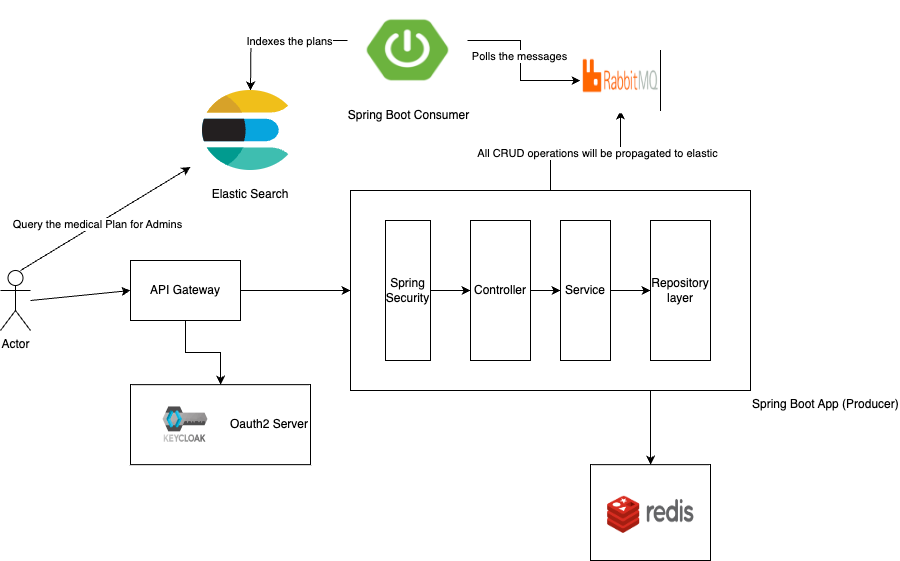

# MediPlan Manager

MediPlan Manager is a medical plan management application intricately designed to enhance system performance, transparency in data flow, and uphold security measures within the healthcare sector. By leveraging the power of Spring Boot 3, Redis Cache, RabbitMQ, and OAuth 2.0 authentication via Keycloak, this application provides fortified security with the application able to scale in a distributed environment. A notable feature of this application is its adherence to HIPAA compliance standards, prioritizing the confidentiality and security of health information.

## Features

- **Enhanced Performance**: Boosted application’s responsiveness and throughput with the integration of HTTP caching utilizing eTAGs and Redis Cache, which lead to an approximately 50% surge in request handling capacity.
- **Secured Authentication**: Integrated OAuth 2.0 authentication through Keycloak, further safeguarded with JWT Auth Tokens.
- **Advanced Search Capabilities**: Implemented ELK Stack to refine full-text search capabilities, enhancing data accessibility and usability.
- **Robust Data Flow**: Facilitated seamless data flow and transaction management with the help of RabbitMQ.
- **HIPAA Compliance**: Designed considering HIPAA standards, to ensure the utmost security and confidentiality of medical data.

## Architecture




## Technologies Used

- Spring Boot 3
- Redis Cache
- RabbitMQ
- OAuth 2.0 (via Keycloak)
- ELK Stack
- JWT Authentication


## Getting Started

Before you begin, ensure you have met the following requirements:
- You have installed Java 17 or later.
- You have a working installation of Maven.
- You have Redis and RabbitMQ set up in your environment.
- You have an instance of Keycloak running for OAuth 2.0 authentication.

### Step 1: Clone the Repository

```sh
git clone https://github.com/yourusername/mediplan-manager.git
cd mediplan-manager
cd demo-two
```

### Step 2: Configure Keycloak

Follow the official [Keycloak documentation](https://www.keycloak.org/docs/latest/server_admin/) to set up OAuth 2.0 authentication for your application.

### Step 3: Setup Environment Variables

Ensure to configure the necessary environment variables in your `application.yml` or `application.properties` files including Redis, RabbitMQ, and Keycloak configurations.

### Step 4: Build and Run the Application

```sh
mvn clean install
mvn spring-boot:run
```

Your application should now be running at `http://localhost:8080`.

## Contribution

Feel free to fork the project and submit your contributions via pull requests.

## License

This project is licensed under the [MIT License](LICENSE).

## Contact

If you encounter any issues or have suggestions, please open an issue on GitHub.

---

